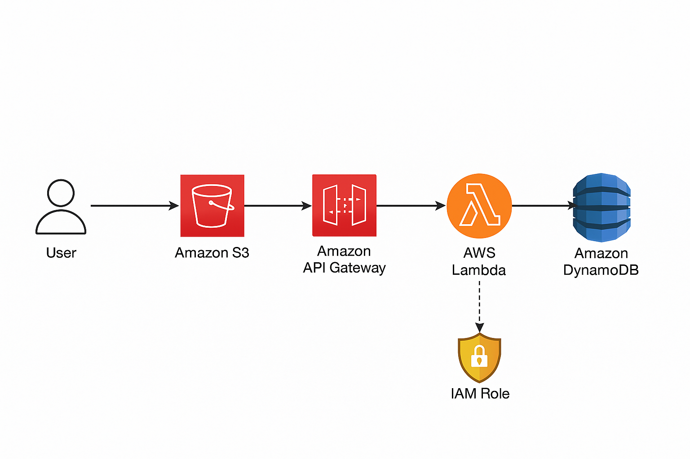

# AWS Serverless Student Data App

This project is a serverless web application for saving and viewing student data, deployed using AWS services including S3, Lambda, API Gateway, DynamoDB, CloudFront, and IAM roles.

## Features

- Save student data (ID, name, class, age) via a web form.
- View all saved students in a table.
- Fully serverless architecture using AWS.

## AWS Services Used

- **S3 Bucket:** Hosts the static frontend (HTML, CSS, JS).
- **Lambda Functions:**  
  - `insertStudentData.py` (POST): Saves student data to DynamoDB.
  - `getStudents.py` (GET): Retrieves all student records.
- **API Gateway:** Provides RESTful endpoints for frontend to interact with Lambda functions.
- **DynamoDB:** Stores student data.
- **CloudFront:** Distributes the frontend globally with low latency.
- **IAM Role:** Grants necessary permissions to Lambda functions for accessing DynamoDB.

## Project Structure

- `index.html`: Main web page.
- `scripts.js`: Handles AJAX requests to API Gateway.
- `insertStudentData.py`: Lambda function for saving student data.
- `getStudents.py`: Lambda function for retrieving student data.

## Deployment Steps

1. **Frontend Hosting**
   - Upload `index.html` and `scripts.js` to an S3 bucket.
   - Configure the bucket for static website hosting.
   - Set up CloudFront to distribute the S3 content.

2. **Backend Setup**
   - Create a DynamoDB table named `studentData` with `studentid` as the primary key.
   - Deploy `insertStudentData.py` and `getStudents.py` as Lambda functions.
   - Create an IAM role with permissions for Lambda to access DynamoDB.
   - Set up API Gateway with:
     - `POST /` → `insertStudentData` Lambda
     - `GET /` → `getStudents` Lambda
     - Enable CORS for both endpoints.

3. **Configuration**
   - Update the API endpoint in `scripts.js` to match your API Gateway URL.

## Usage

- Open the web page via the CloudFront URL.
- Enter student details and click **Save Student Data**.
- Click **View all Students** to see all records.

## Architectural Diagram :

## License

MIT License
